---
## Author
author:
  name: Лащиков Алексей Антонович
  email: 1032253527@pfur.ru
  affiliation:
    - name: Российский университет дружбы народов
      country: Российская Федерация
      postal-code: 117198
      city: Москва
      address: ул. Миклухо-Маклая, д. 6

## Title
title: "Отчёт по лабораторной работе №3"
subtitle: "Язык разметки Markdown"
license: "CC BY"
---

# Цель работы

Цель данной лабораторной работы --- освоение процедуры компиляции и сборки программ, написанных на ассемблере NASM.

# Выполнение лабораторной работы

## Программа Hello world!

Создал каталог для работы с программами на языке ассемблера NASM и перешёл в него ([рис. @fig-001]).

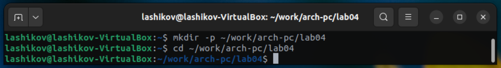{#fig-001 width=70%}

Создал текстовый файл с именем hello.asm и открыл этот файл с помощью gedit ([рис. @fig-002]).

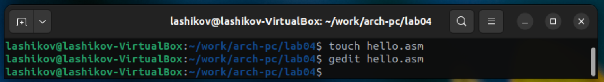{#fig-002 width=70%}

Ввёл в файл данный текст ([рис. @fig-003]).

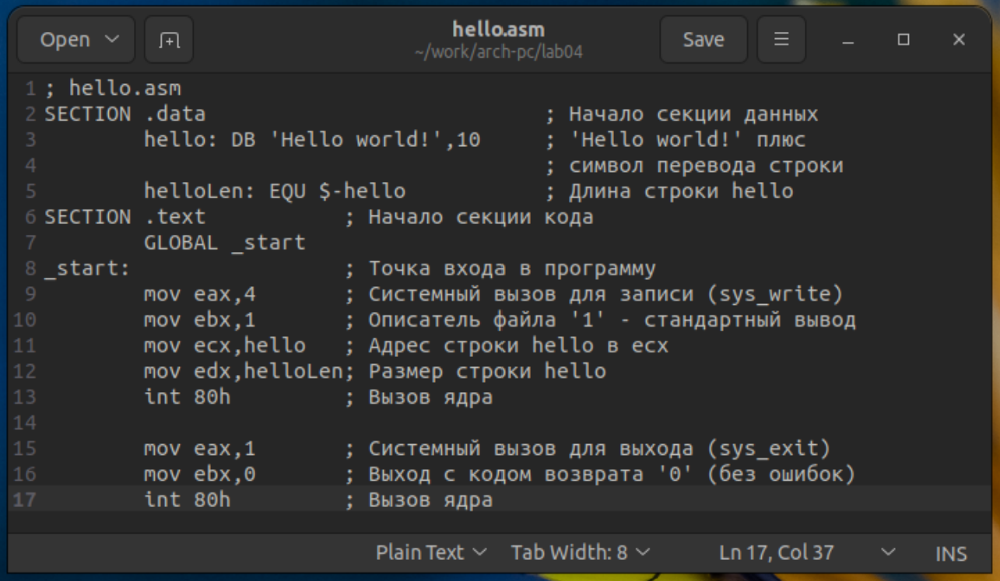{#fig-003 width=70%}

## Транслятор NASM

Выполнил компиляцию приведённого выше текста и проверил, что объектный файл "hello.o" был создан ([рис. @fig-004]).

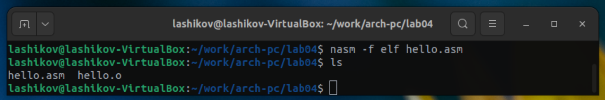{#fig-004 width=70%}

## Расширенный синтаксис командной строки NASM

Выполнил данную команду и проверил, что файлы list.lst и obj.o были созданы ([рис. @fig-005]).

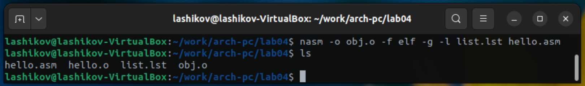{#fig-005 width=70%}

## Компоновщик LD 

Передал объектный файл на обработку компоновщику и проверил, что исполняемый файл hello был создан ([рис. @fig-006]).

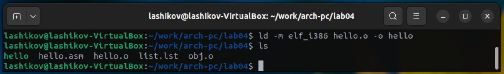{#fig-006 width=70%}

Выполнил данную команду. Исполняемый файл имеет имя main. Объектный файл, из которого собран этот исполняемый файл имеет имя obj.o ([рис. @fig-007]).

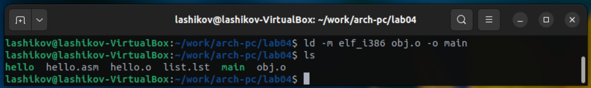{#fig-007 width=70%}

Запустил на выполнение созданный исполняемый файл ([рис. @fig-008]).

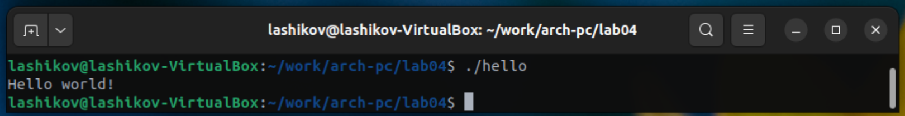{#fig-008 width=70%}

# Выполнение заданий для самостоятельной работы

В каталоге ~/work/arch-pc/lab04 создал копию файла hello.asm с именем lab4.asm ([рис. @fig-009]).

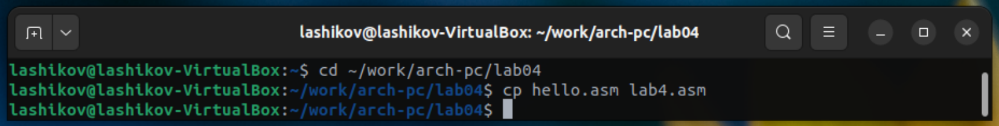{#fig-009 width=70%}
 
Внёс изменения в текст программы lab4.asm. Оттранслировал полученный текст программы lab4.asm в объектный файл. Выполнил компановку объектного файла и запустил получившийся исполняемый файл ([рис. @fig-010]).
 
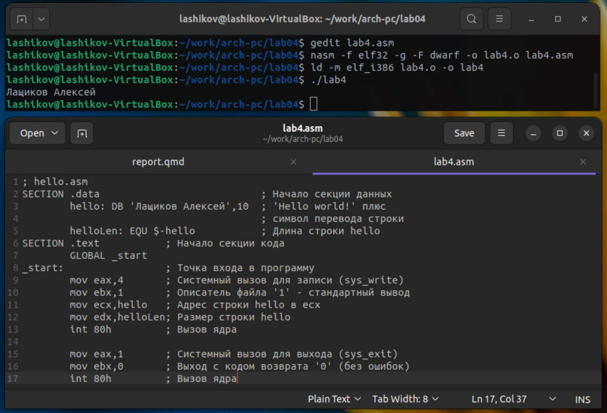{#fig-010 width=70%}

Скопировал файлы hello.asm и lab4.asm в мой локальный репозиторий в каталог ~/work/study/2023-2024/"Архитектура компьютера"/arch-pc/labs/lab04 и загрузил файлы на Github ([рис. @fig-011]).

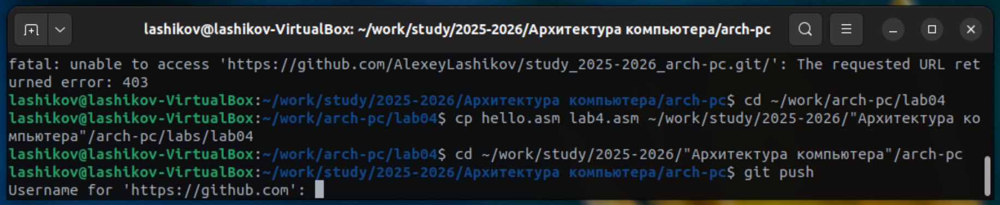{#fig-011 width=70%}

# Выводы

Я освоил Markdown, Quarto и Makefile. Настроил структуру проекта и подключил скриншоты. В ходе данной лабораторной работы я своил процедуру оформления отчётов.

# Список литературы{.unnumbered}

::: {#refs}
:::
