---
## Author
author:
  name: Лащиков Алексей Антонович
  email: 1032253527@pfur.ru
  affiliation:
    - name: Российский университет дружбы народов
      country: Российская Федерация
      postal-code: 117198
      city: Москва
      address: ул. Миклухо-Маклая, д. 6

## Title
title: "Отчёт по лабораторной работе №5"
subtitle: "Основы работы с Midnight Commander (mc). Структура программы на языке ассемблера NASM. Системные вызовы в ОС GNU Linux"
license: "CC BY"
---

# Цель работы

Цель данной лабораторной работы --- приобретение практических навыков в Midnight Commander. Освоение инструкций языка ассемблера mov и int.

# Выполнение лабораторной работы

Открыл Midnight Commander, перешёл в каталог ~/work/arch-pc и создал папку lab05 ([рис. @fig-001]).

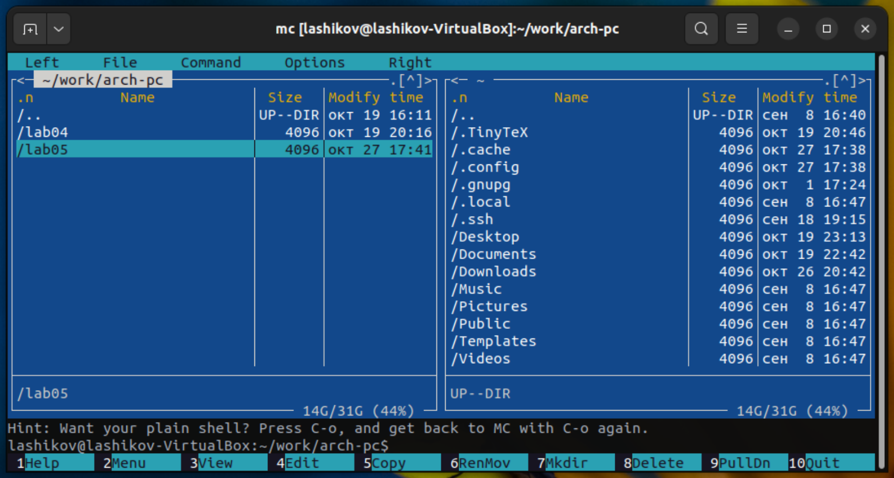{#fig-001 width=70%}

Перешёл в созданный каталог lab05 и создал там файл lab5-1.asm ([рис. @fig-002]).

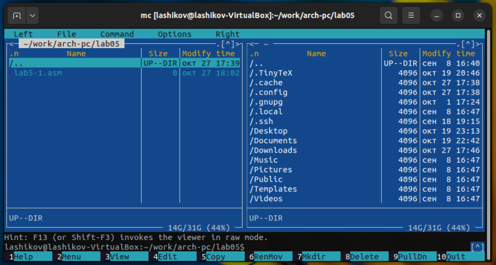{#fig-002 width=70%}

Открыл файл lab5-1.asm для редактирования в редакторе mcedit ([рис. @fig-003]).

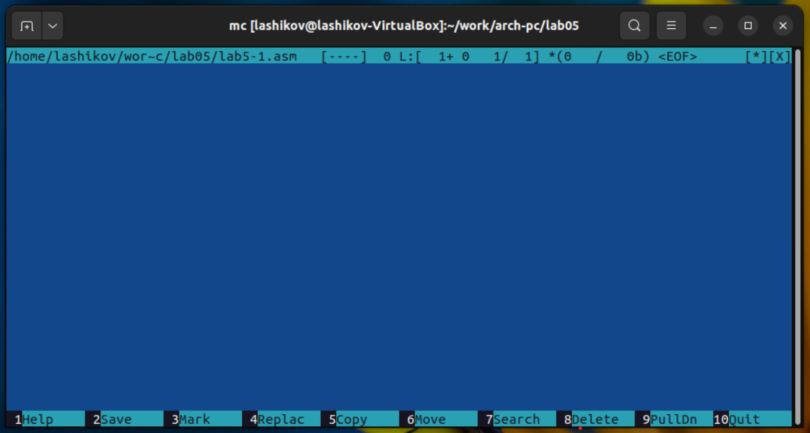{#fig-003 width=70%}

Ввёл данный текст программы, сохранил изменения и закрыл файл ([рис. @fig-004]).

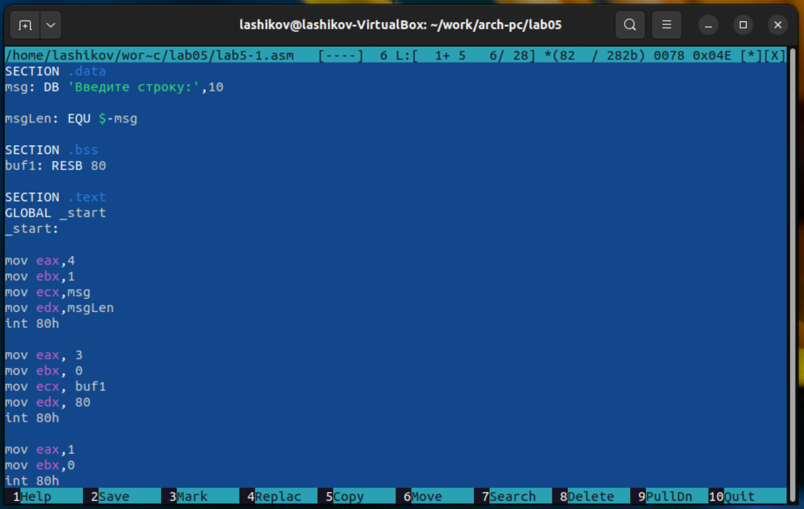{#fig-004 width=70%}

С помощью функциональной клавиши открыл файл lab5-1.asm для просмотра и убедился, что файл содержит текст программы ([рис. @fig-005]).

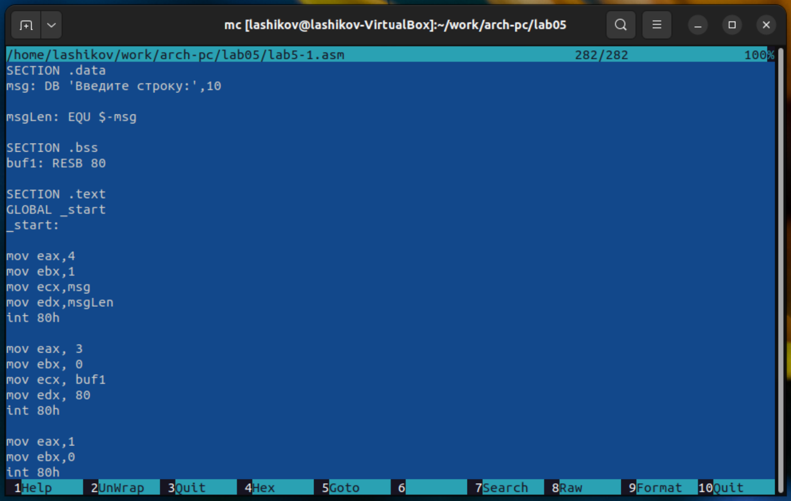{#fig-005 width=70%}

Оттранслировал текст программы lab5-1.asm в объектный файл, выполнил компановку объектного файла и запустил получившийся исполняемый файл. На запрос ввёл своё ФИО ([рис. @fig-006]).

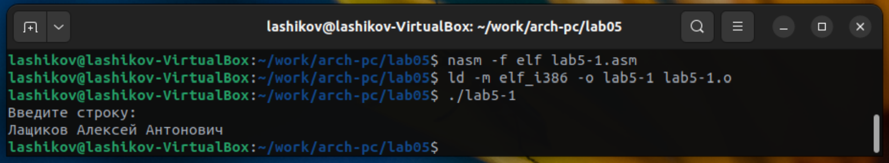{#fig-006 width=70%}

В одной из панелей mc открыл каталог с файлом lab5-1.asm, в другой со скаченным файлом in_out.asm. Скопировал файл in_out.asm в каталог с файлом lab5-1.asm. ([рис. @fig-007]).

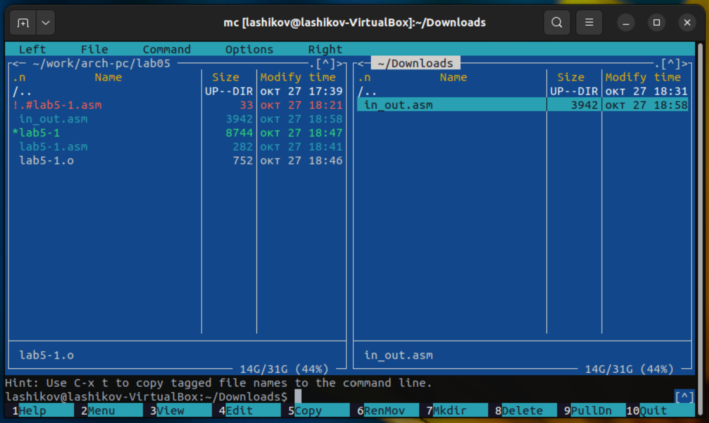{#fig-007 width=70%}

Создал копию файла lab5-1.asm с именем lab5-2.asm ([рис. @fig-008]).

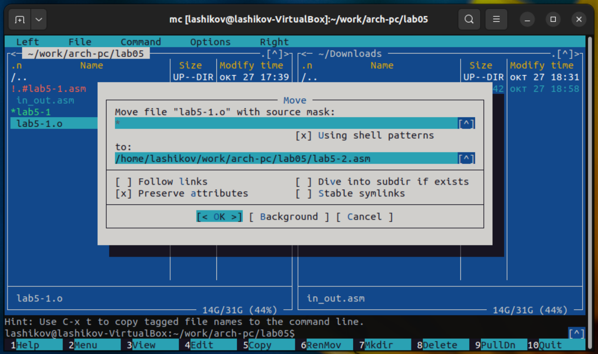{#fig-008 width=70%}

Исправил текст программы в файле lab5-2.asm с использованием подпрограмм из внешнего файла in_out.asm ([рис. @fig-009]).

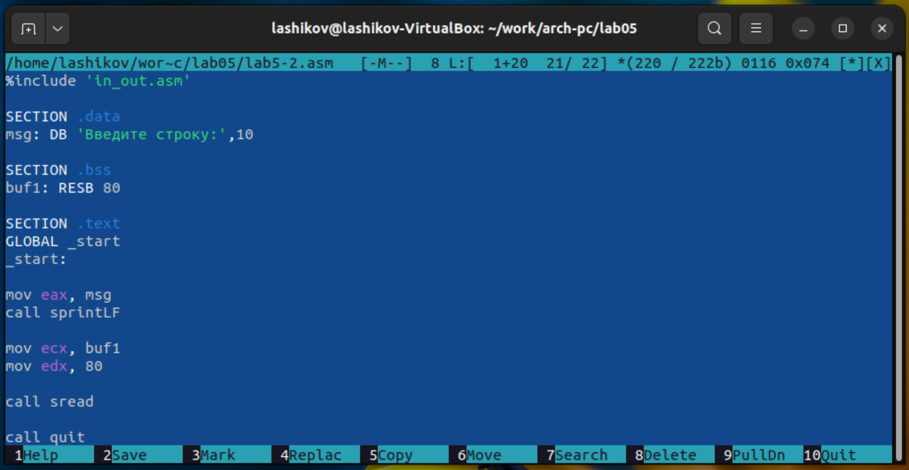{#fig-009 width=70%}
 
Оттранслировал полученный текст программы lab5-2.asm в объектный файл. Выполнил компановку объектного файла и запустил получившийся исполняемый файл ([рис. @fig-010]).
 
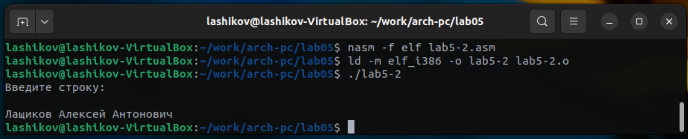{#fig-010 width=70%}

В файле lab5-2.asm заменил подпрограмму sprintLF на sprint. Создал исполняемый файл и проверил его работу. Разница между этими командами заключается в том, что sprintLF при выводе добавляет перенос строки, а sprint --- нет ([рис. @fig-011]).

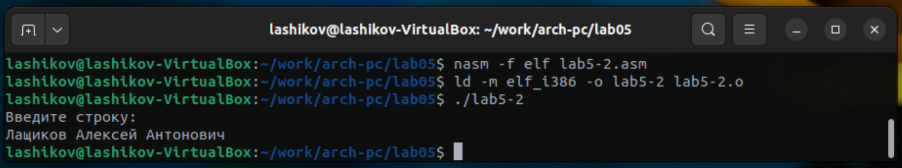{#fig-011 width=70%}

# Задания для самостоятельной работы

Создал копию файла lab5-1.asm c именем lab5-1-copy.asm и внёс изменения в программу (без использования внешнего файла in_out.asm), так чтобы она работала по алгоритму: вывод приглашения типа "Введите строку:", ввод строки с клавиатуры, вывод введённой строки на экран ([рис. @fig-012]).

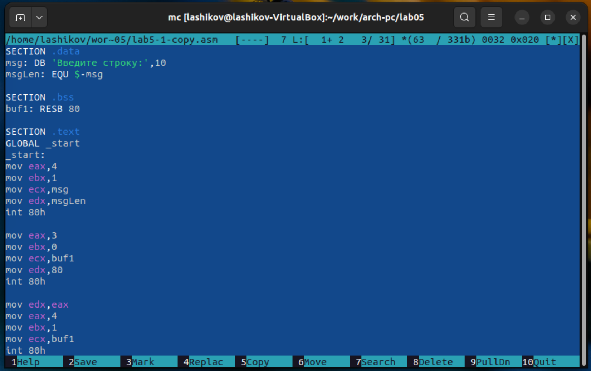{#fig-012 width=70%}

Получил исполняемый файл и проверил его работу ([рис. @fig-013]).

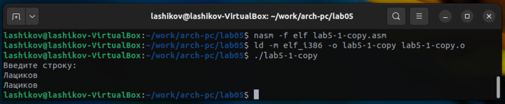{#fig-013 width=70%}

Создал копию файла lab5-2.asm c именем lab5-2-copy.asm и внёс изменения в программу с использованием подпрограмм из внешнего файла in_out.asm, так чтобы она работала по алгоритму: вывод приглашения типа "Введите строку:", ввод строки с клавиатуры, вывод введённой строки на экран  ([рис. @fig-014]).

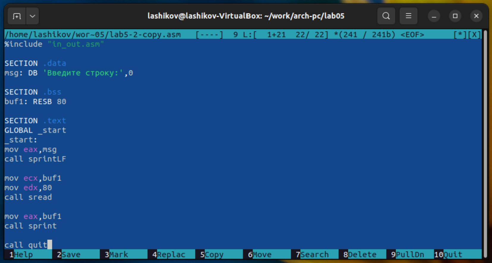{#fig-014 width=70%}

Создал исполняемый файл и проверил его работу ([рис. @fig-015]).

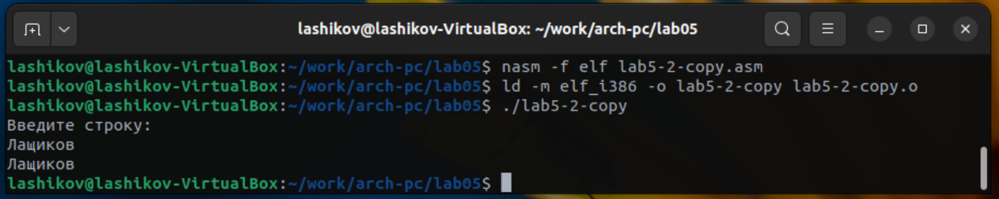{#fig-015 width=70%}

# Выводы

Я приобрёл практические навыки работы в Midnight Commander и освоил инструкции языка ассемблера mov и int.
