---
## Author
author:
  name: Лащиков Алексей Антонович
  email: 1032253527@pfur.ru
  affiliation:
    - name: Российский университет дружбы народов
      country: Российская Федерация
      postal-code: 117198
      city: Москва
      address: ул. Миклухо-Маклая, д. 6

## Title
title: "Отчёт по лабораторной работе №6"
subtitle: "Арифметические инструкции языка ассемблера NASM"
license: "CC BY"
---

# Цель работы

Цель данной лабораторной работы --- освоение арифметических инструкций языка ассемблера NASM.

# Выполнение лабораторной работы

## Символьные и численные данные в NASM

Создал каталог для программ лабораторной работы №6, перешёл в него и создал файл lab6-1.asm ([рис. @fig-001]).

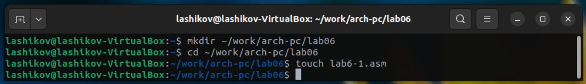{#fig-001 width=70%}

Ввёл в файл lab6-1.asm текст программы из листинга 6.1. ([рис. @fig-002]).

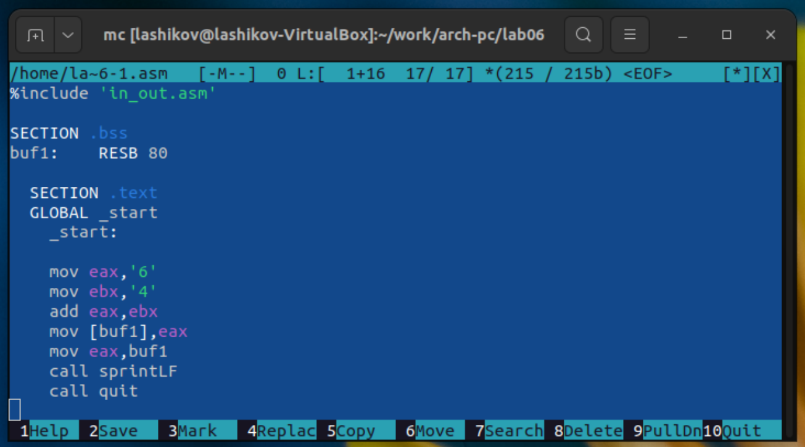{#fig-002 width=70%}

Создал исполняемый файл и запустил его ([рис. @fig-003]).

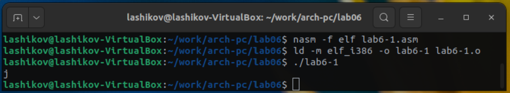{#fig-003 width=70%}

Изменил текст программы, вместо символов записав в регистры числа ([рис. @fig-004]).

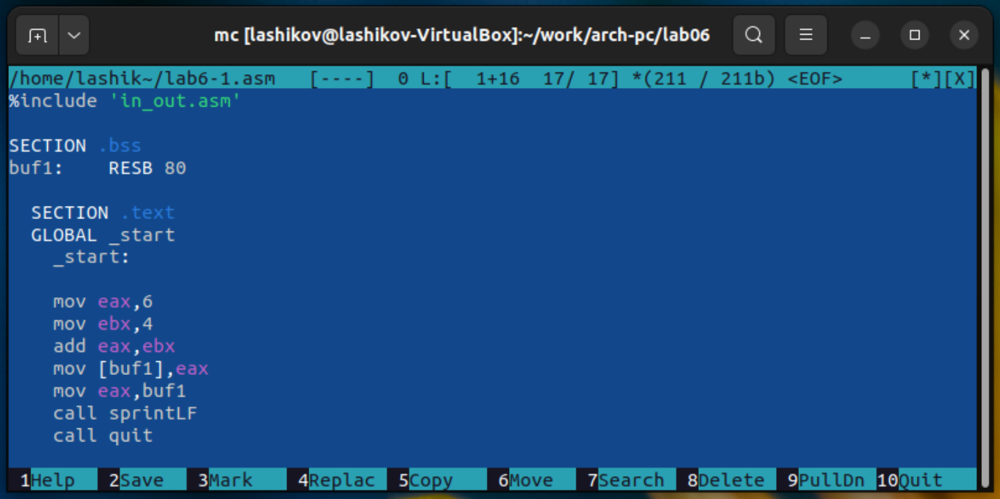{#fig-004 width=70%}

Создал исполняемый файл и запустил его. Пользуясь таблицей ASCII определил, что код 10 соответствует символу LF (Line Feed), символу перевода строки. Этот символ не имеет графического отображения. При выводе на экран он не отображается как видимый знак, а вызывает переход курсора на новую строку ([рис. @fig-005]).

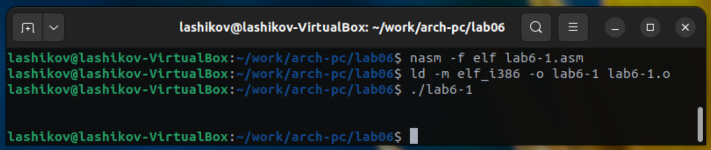{#fig-005 width=70%}

Создал файл lab6-2.asm в каталоге ~/work/arch-pc/lab06 и ввёл в него текст программы из листинга 6.2. ([рис. @fig-006]).

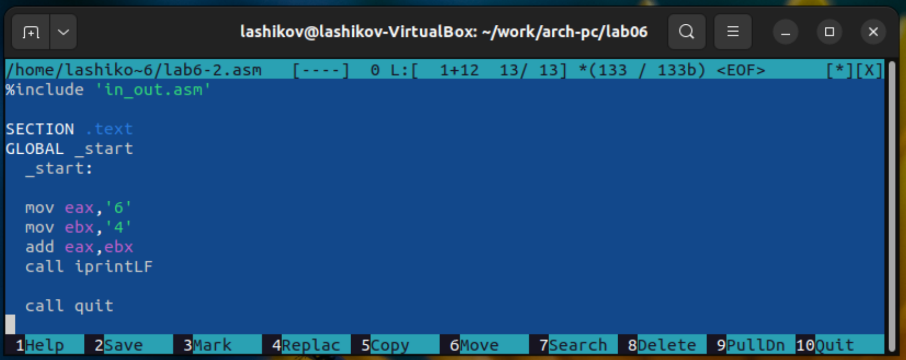{#fig-006 width=70%}

Создал исполняемый файл и запустил его ([рис. @fig-007]).

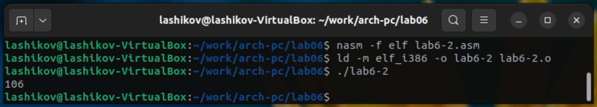{#fig-007 width=70%}

Аналогично предыдущему примеру изменил символы на числа, создал исполняемый и запустил его. Результат: 10 ([рис. @fig-008]).

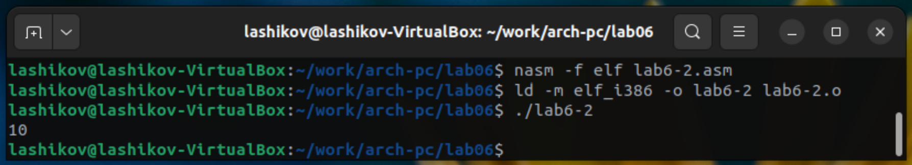{#fig-008 width=70%}

Заменил функцию iprintLF на iprint. Создал исполняемый файл и запустил его. Вывод функций iprintLF и iprint отличается тем, что iprintLF добавляет после числа перевод строки, а iprint --- нет ([рис. @fig-009]).

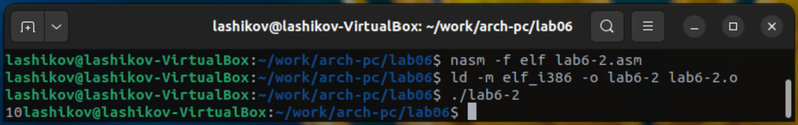{#fig-009 width=70%}

## Выполнение арифметических операций в NASM
 
Создал файл lab6-3.asm в каталоге ~/work/arch-pc/lab06 ([рис. @fig-010]).
 
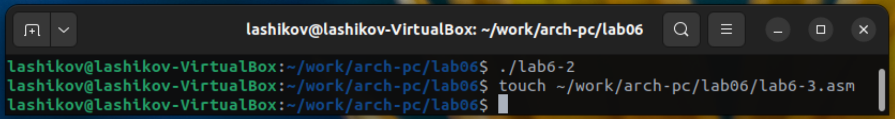{#fig-010 width=70%}

Ввёл текст программы из листинга 6.3. в lab6-3.asm ([рис. @fig-011]).

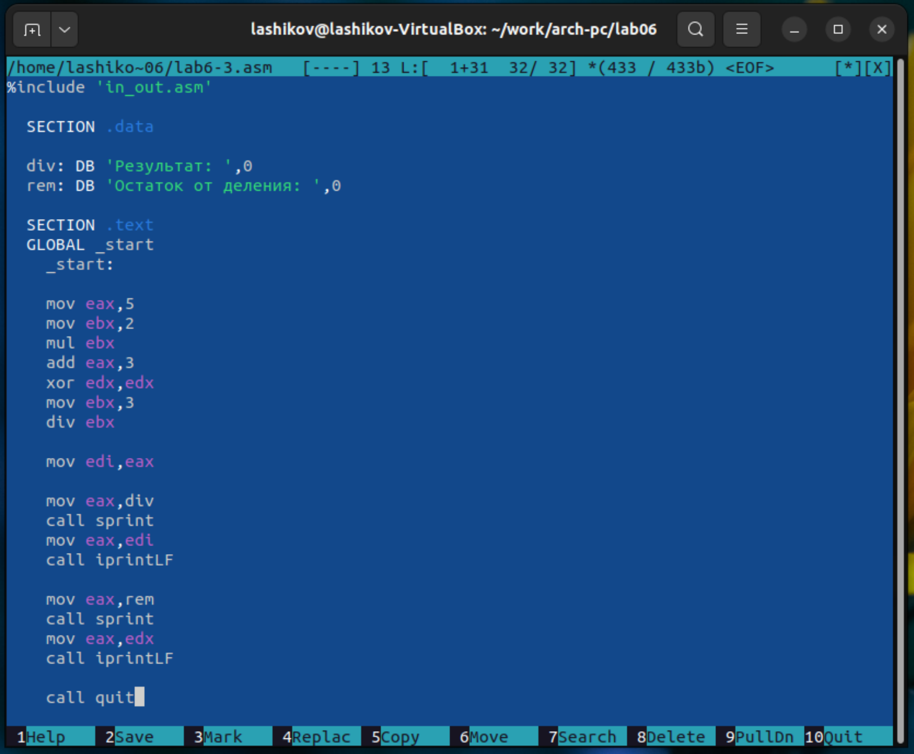{#fig-011 width=70%}

Создал исполняемый файл и запустил его ([рис. @fig-012]).

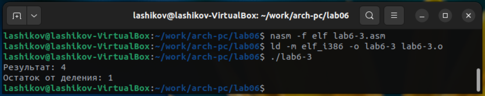{#fig-012 width=70%}

Изменил текст программы для вычисления выражения $f(x)=\frac{4\cdot 6 + 2}{5}$. ([рис. @fig-013]).

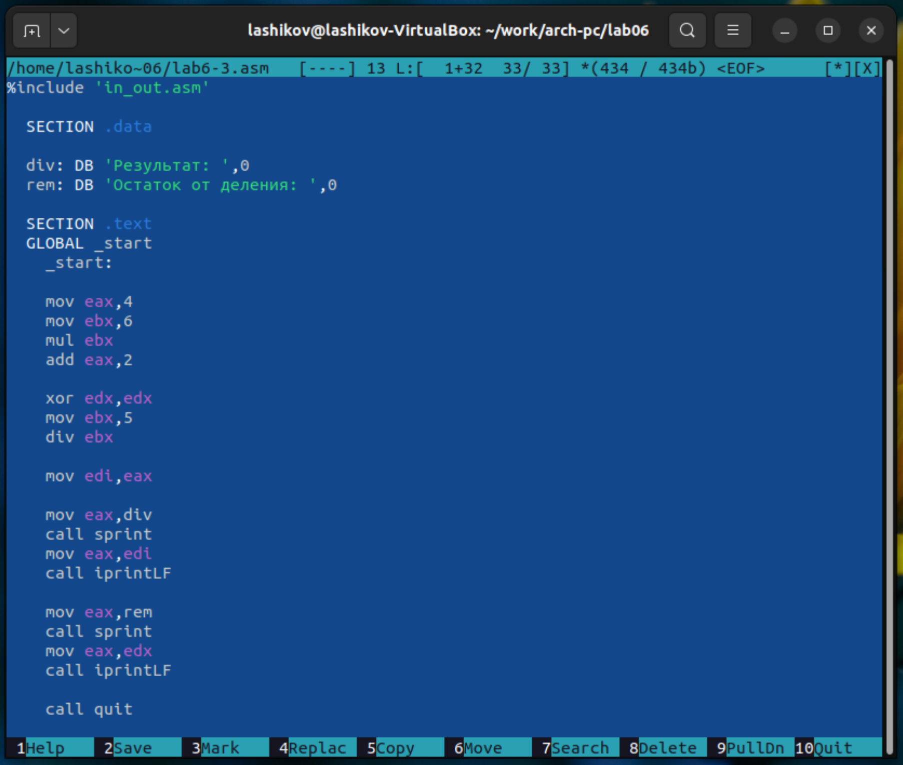{#fig-013 width=70%}

Создал исполняемый файл и запустил его ([рис. @fig-014]).

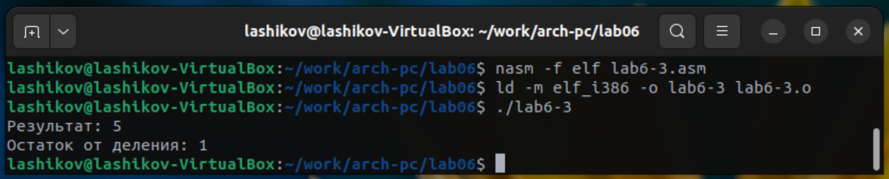{#fig-014 width=70%}

Создал файл variant.asm в каталоге ~/work/arch-pc/lab06 ([рис. @fig-015]).

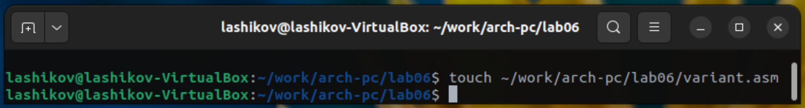{#fig-015 width=70%}

Ввёл текст программы из листинга 6.4 в файл variant.asm ([рис. @fig-016]).

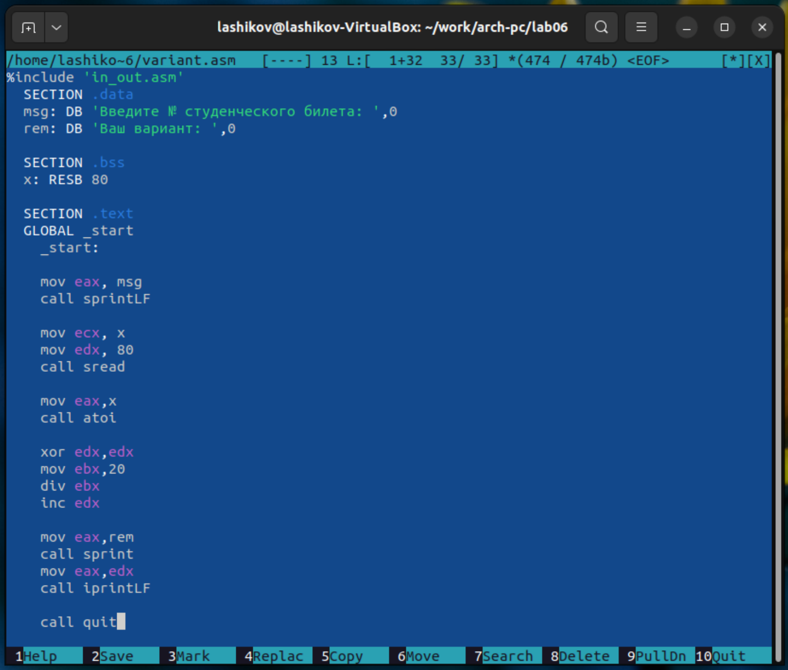{#fig-016 width=70%}

Создал исполняемый файл и запустил его ([рис. @fig-017]).

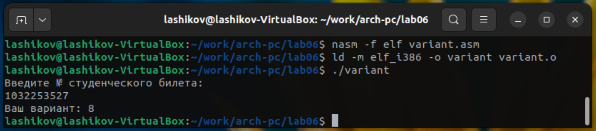{#fig-017 width=70%}

Проверка результата работы программы аналитически:

Формула:
$$
\text{variant}=(S_n \bmod 20)+1.
$$

Расчёты:
$$
\begin{aligned}
S_n &= 1032253527,\\
S_n \bmod 20 &= 27 \bmod 20 = 7,\\
\text{variant} &= (S_n \bmod 20)+1 = 7+1=8.
\end{aligned}
$$

1. Какие строки отвечают за вывод на экран сообщения 'Ваш вариант:'?

```asm
mov eax, rem
call sprint
```

2. Для чего используются следующие инструкции?
```asm
mav ecx, x
mov edx, 80
call sread
```

Они помещают адрес буфера `x` в `ECX` и максимальную длину ввода `80` в `EDX`, после чего `sread` считывает строку из `stdin` в буфер `x` (ввод номера билета).

3. Для чего используется "`call atoi`"?

Преобразует введённую строку (адрес буфера предварительно кладётся в `EAX` через `mov eax, x`) из ASCII в целое число. Результат попадает в `EAX`.	

4. Какие строки отвечают за вычисления варианта?

```asm
xor edx, edx
mov ebx, 20
div ebx
inc edx
```

Эти строки реализуют формулу $(S_n \bmod 20)+ 1$: остаток после `div` в `EDX`, затем `inc edx` даёт "+1".

5. В какой регистр записывается остаток от деления при выполнении инструкции `div ebx`?

В `EDX`.

6. Для чего используется `inc edx`?

Для увеличения остатка на 1, переходя от диапазона '0..19' к '1..20' --- конечный номер варианта.

7. Какие строки отвечают за вывод результата вычислений?

```asm
mov eax, rem
call sprint
mov eax, edx
call iprintLF
```

Сначала печатается текст "Ваш вариант: ", затем значение вварианта из `EDX` с переводом строки.

# Задание для самостоятельной работы

Вид функции $f(x)$, соответствующий полученному номеру (8):
$$
f(x) = (11 + x)\cdot 2 - 6
$$

Написал программу для вычисления y = f(x) ([рис. @fig-018]).

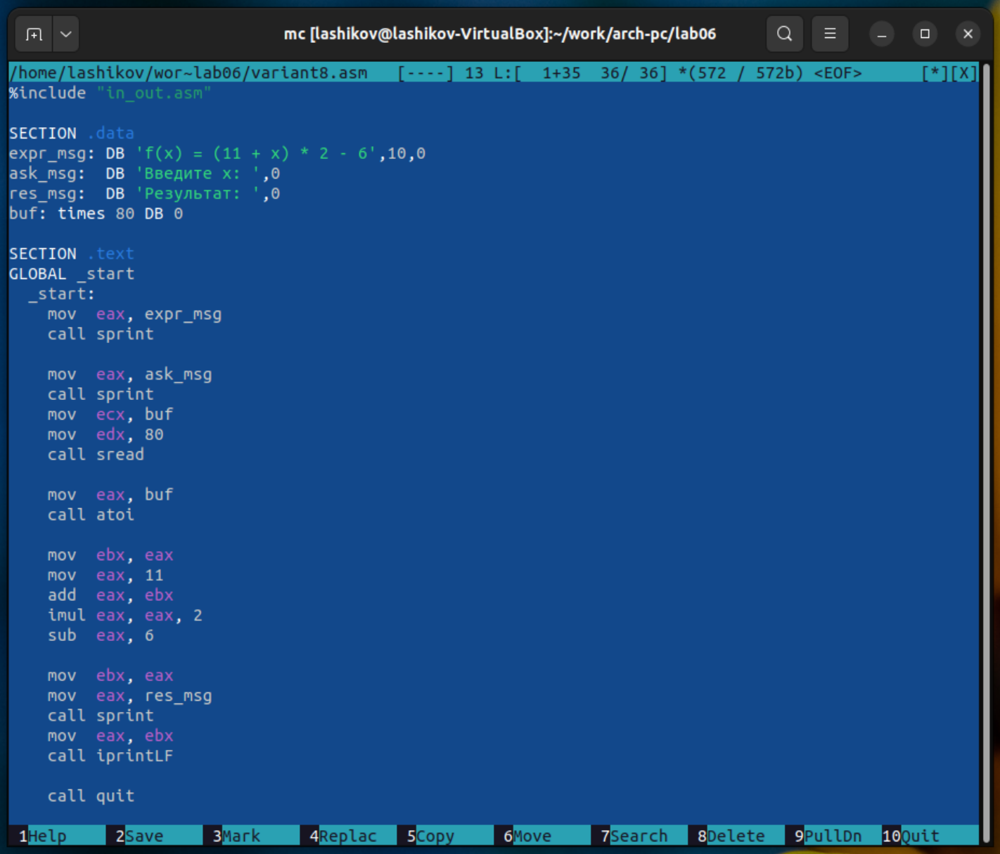{#fig-018 width=70%}

Создал исполняемый файл и проверил его работу для значений $x_1$ и $x_2$ из 6.3. ([рис. @fig-019]).

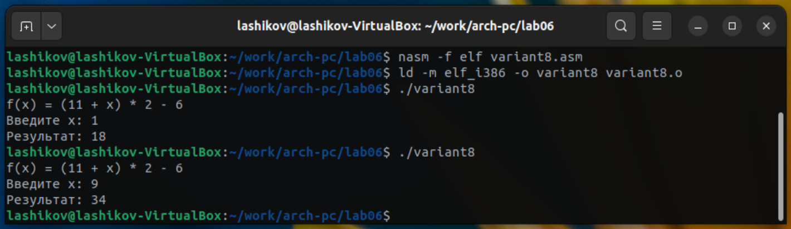{#fig-019 width=70%}

# Выводы

Я освоил арифметические инструкции языка ассемблера NASM.
