---
## Author
author:
  name: Лащиков Алексей Антонович
  email: 1032253527@pfur.ru
  affiliation:
    - name: Российский университет дружбы народов
      country: Российская Федерация
      postal-code: 117198
      city: Москва
      address: ул. Миклухо-Маклая, д. 6

## Title
title: "Отчёт по лабораторной работе №7"
subtitle: "Команды безусловного и условного переходов в NASM. Программирование ветвлений."
license: "CC BY"
---

# Цель работы

Цель данной лабораторной работы --- изучение команд условного и безусловного переходов. Приобретение навыков написания программ с использованием переходов. Знакомство с назначением и структурой файла листинга.

# Выполнение лабораторной работы

## Реализация переходов в NASM

Создал каталог для программ лабораторной работы №7, перешёл в него и создал файл lab7-1.asm ([рис. @fig-001]).

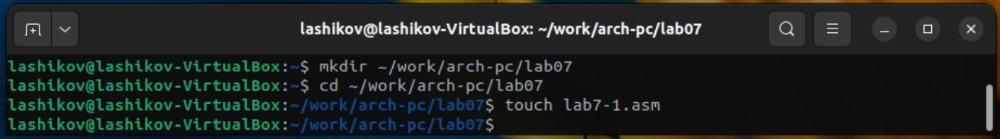{#fig-001 width=70%}

Ввёл в файл lab7-1.asm текст программы из листинга 7.1. ([рис. @fig-002]).

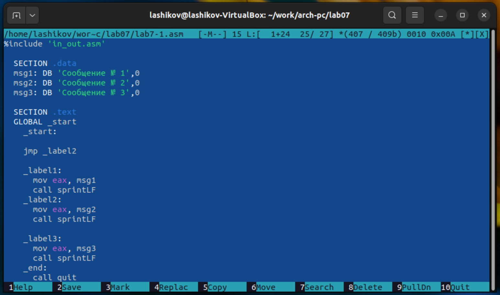{#fig-002 width=70%}

Создал исполняемый файл и запустил его ([рис. @fig-003]).

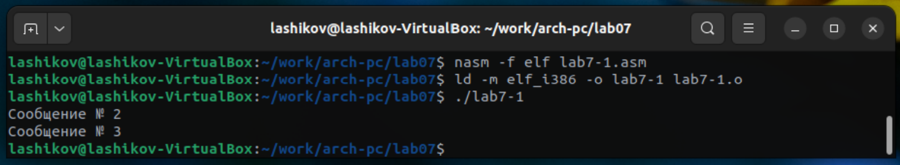{#fig-003 width=70%}

Изменил текст программы в соответствии с листингом 7.2. ([рис. @fig-004]).

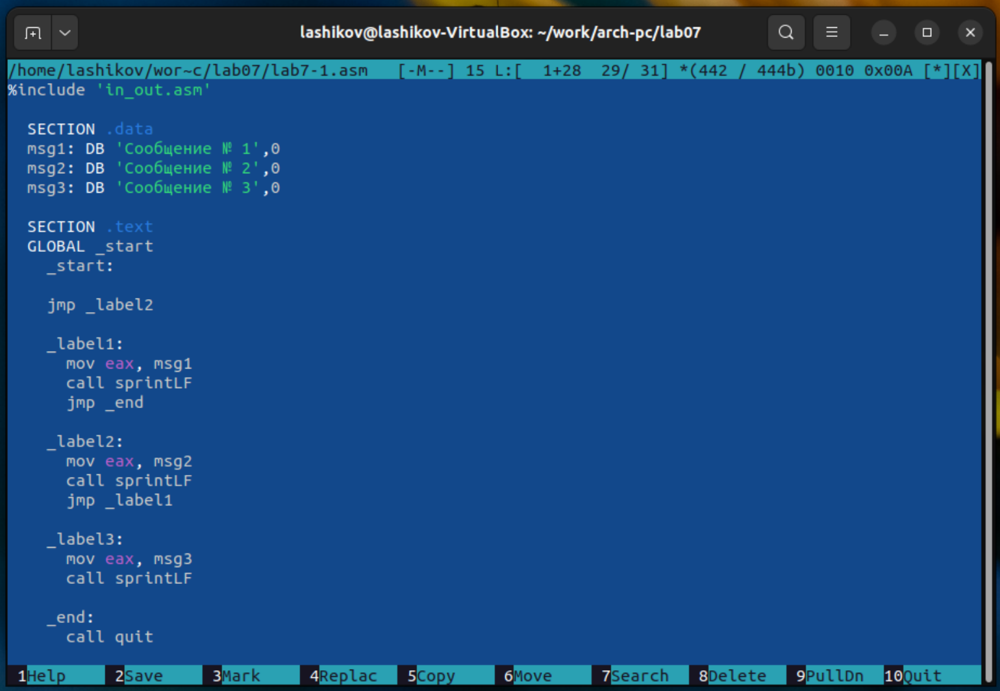{#fig-004 width=70%}

Создал исполняемый файл и проверил его работу ([рис. @fig-005]).

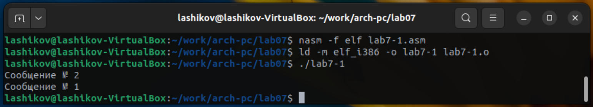{#fig-005 width=70%}

Изменил текст программы, чтобы вывод программы был следующим: Сообщение №3, Сообщение №2, Сообщение №1 ([рис. @fig-006]).

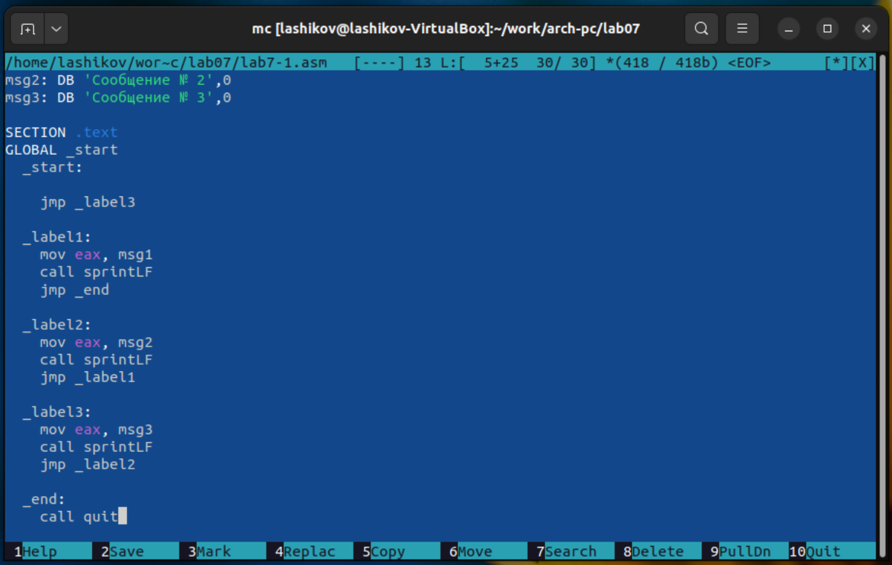{#fig-006 width=70%}

Создал исполняемый файл и запустил его ([рис. @fig-007]).

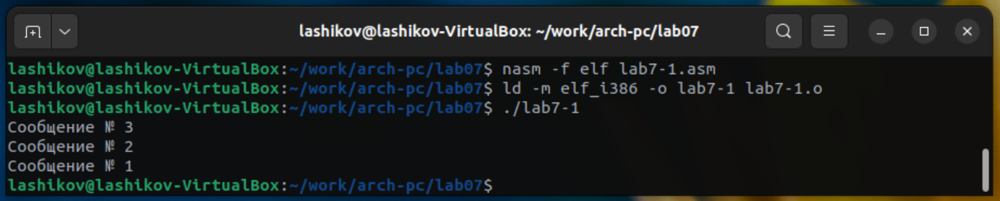{#fig-007 width=70%}

Создал файл lab7-2.asm в каталоге ~/work/arch-pc/lab07 и ввёл в него текст программы из листинга 7.3. ([рис. @fig-008]).

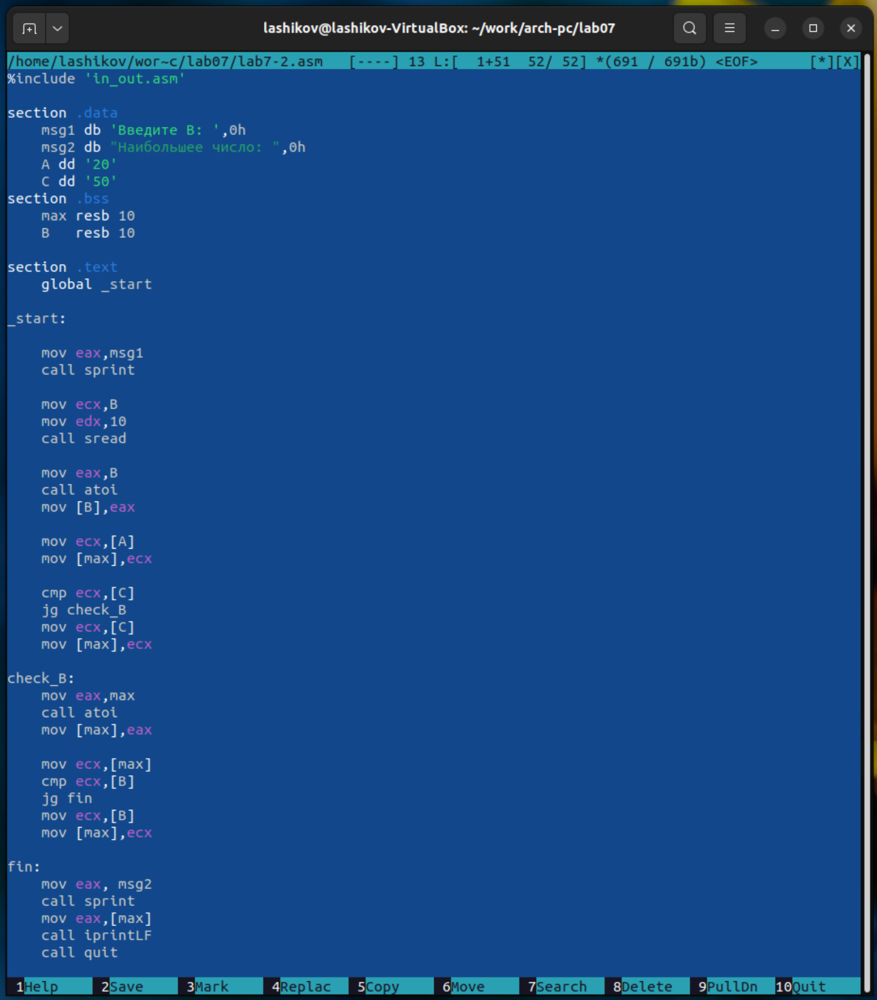{#fig-008 width=70%}

Создал исполняемый файл и проверил его работу для разных значений B ([рис. @fig-009]).

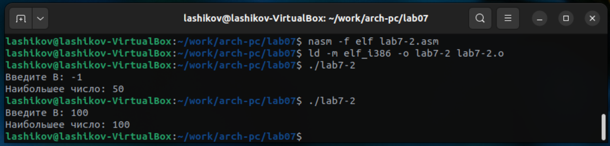{#fig-009 width=70%}

## Изучение структуры файла листинга

Создал файл листинга для программы из файла lab7-2.asm ([рис. @fig-010]).

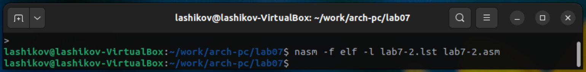{#fig-010 width=70%}

Открыл файл листинга lab7-2.asm с помощью mcedit ([рис. @fig-011]).

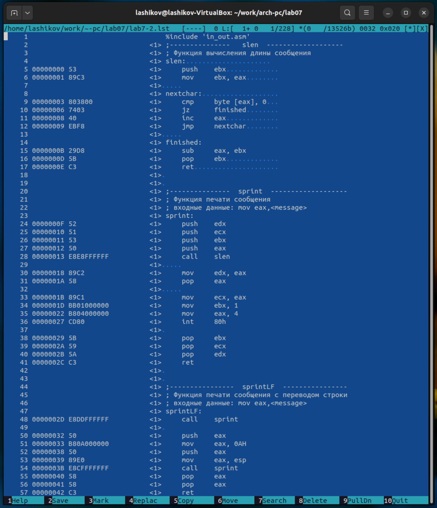{#fig-011 width=70%}

*Объяснение содержимого строки 5:*

```asm
5  00000000  53          <1>  push    ebx
```

5 --- номер строки в листинге.

00000000 --- смещение команды push ebx от начала сегмента .text. Команда стоит самой первой в коде, поэтому адрес 0.

53 --- машинный код инструкции push ebx в шестнадцатеричном виде.

<1> --- первый проход ассемблера NASM.

push ebx --- исходная инструкция. Она сохраняет значение регистра EBX, чтобы потом его можно было восстановить.

*Объяснение содержимого строки 9:*

```asm
9  00000003  803800      <1>  cmp     byte [eax], 0
```

9 --- номер строки в листинге.

00000003 --- смещение этой команды в сегменте .text. Она идёт третьей по счёту (после push ebx и mov ebx, eax), поэтому адрес 3.

803800 --- машинный код команды сравнения cmp byte [eax], 0:

80 --- код операции «cmp r/m8, imm8» (сравнить байт по адресу с константой).
38 --- байт ModR/M, задаёт адресный режим [eax].
00 --- сравниваемая константа 0.

<1> --- первый проход ассемблера.

cmp byte [eax], 0 --- исходная строка. Сравниваем байт по адресу в EAX с нулём --- то есть проверяем, достигли ли конца строки.

*Объяснение содержимого строки 34:*

```asm
34  0000001D  BB01000000    <1>  mov     ebx, 1
```

34 --- номер строки в листинге.

0000001D --- смещение команды внутри сегмента .text.

BB01000000 --- машинный код инструкции mov ebx, 1:

BB --- opcode «mov ebx, imm32».

01000000 --- непосредственное значение 1 в формате little-endian (01 00 00 00).

<1> --- первый проход ассемблера.

mov ebx, 1 --- исходная строка. В функции sprint эта команда записывает в EBX номер файлового дескриптора 1 (стандартный вывод, stdout) для системного вызова int 80h.

Открыл файл с программой lab7-2.asm и удалил операнд [A] из инструкции mov ecx,[A]  ([рис. @fig-012]).

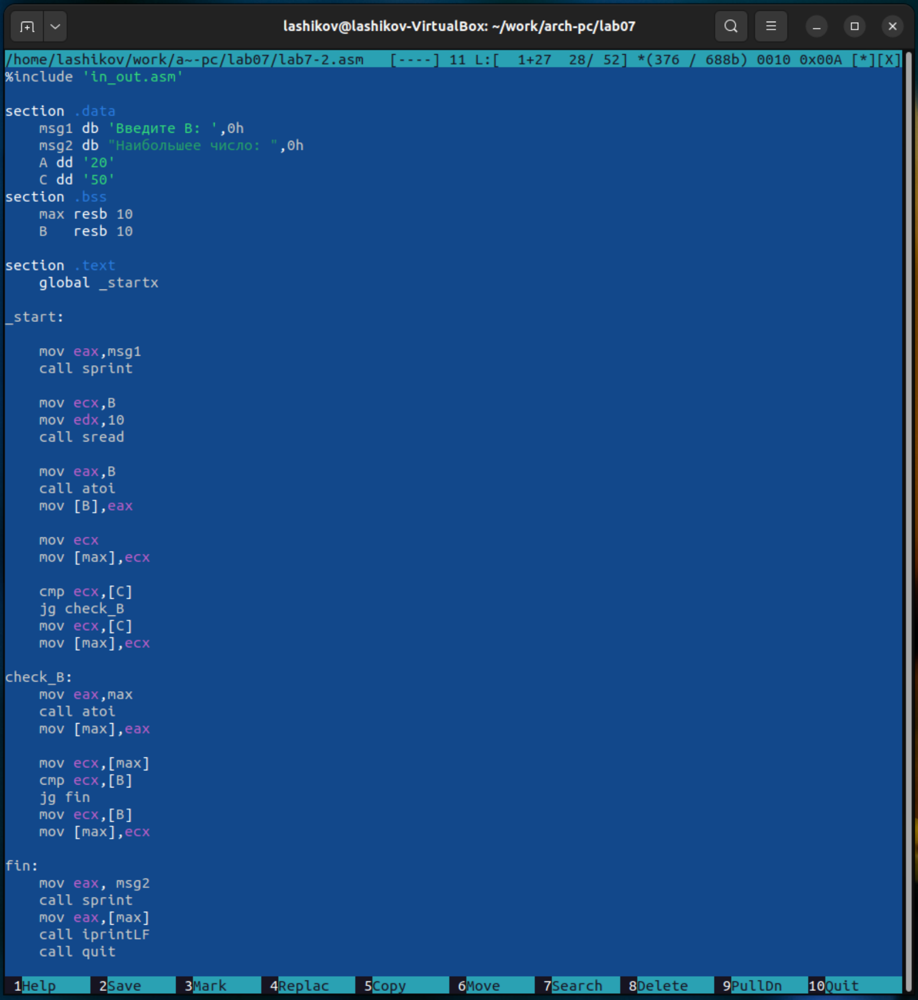{#fig-012 width=70%}

Выполнил трансляцию с получением файла листинга ([рис. @fig-013]).

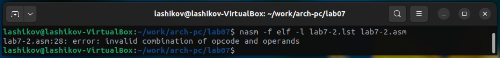{#fig-013 width=70%}

Объектный файл `lab7-2.o` не создаётся, так как в программе обнаружена синтаксическая ошибка.

Файл листинга `lab7-2.lst` создаётся, для ошибочной строки добавляется диагностическое сообщение.

## Задание для самостоятельной работы

### Задание 1. Нахождение наименьшей из трёх целочисленных переменных

Вариант 8:
a = 52, b = 33, c = 40

Написал программу нахождения наименьшей из 3 целочисленных переменных a, b и c ([рис. @fig-014]).

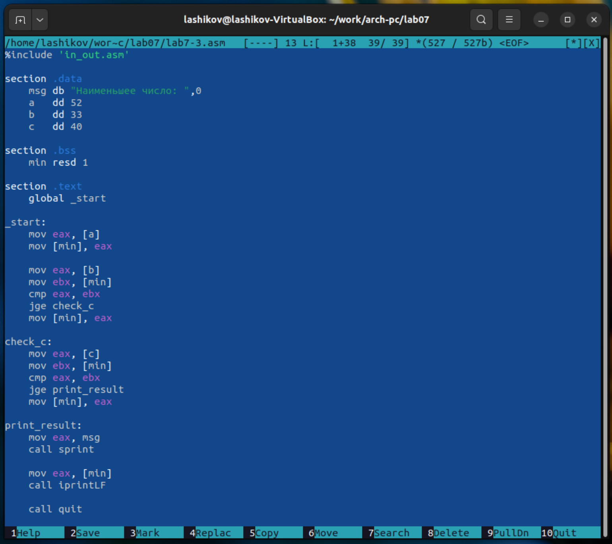{#fig-014 width=70%}

Создал исполняемый файл и проверил его работу ([рис. @fig-015]).

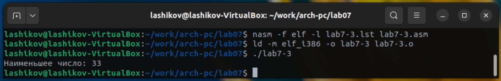{#fig-015 width=70%}

### Задание 2. Вычисление функции f(x)

Вариант 8:

$$
f(x) =
\begin{cases}
3a, & a < 3, \\
x + 1, & a \ge 3.
\end{cases}
$$

Программа запрашивает с клавиатуры значения x и a, вычисляет f(x) по формуле и выводит результат.

Тестовые пары из таблицы:  
(x₁, a₁) = (1; 4) → a ≥ 3 ⇒ f(x) = x + 1 = 2  
(x₂, a₂) = (1; 2) → a < 3 ⇒ f(x) = 3a = 6

Написал программу, которая для введённых с клавиатуры значений x и a вычисляет значение заданной функции f(x) и выводит результат вычислений ([рис. @fig-016]).

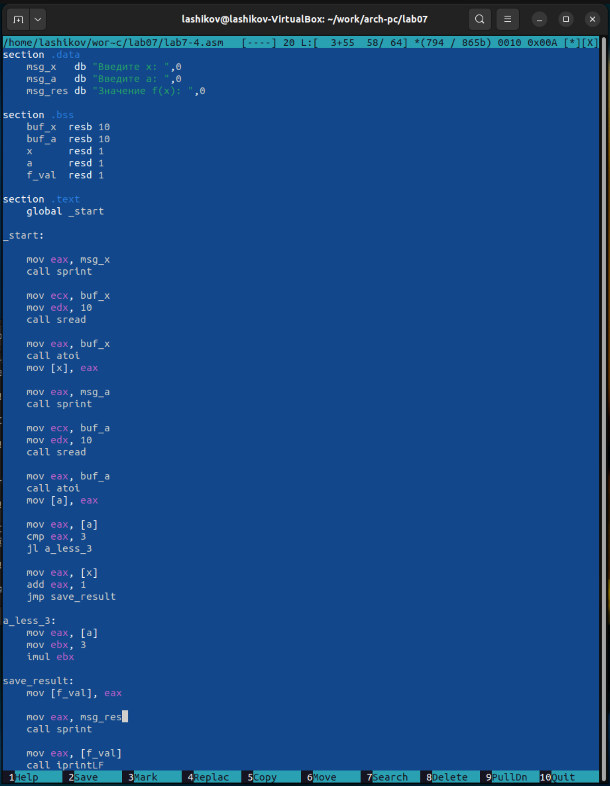{#fig-016 width=70%}

Создал исполняемый файл и проверил его работу  ([рис. @fig-017]).

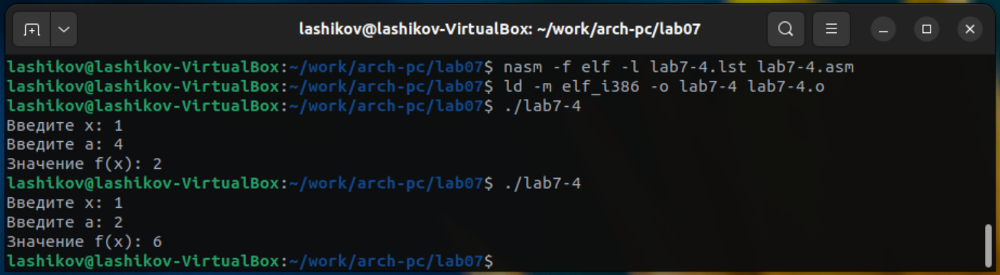{#fig-017 width=70%}

# Выводы

Я изучил команды условного и безусловного переходов. Приобрёл навыки написания программ с использованием переходов. Познакомился с назначением и структурой файла листинга.
